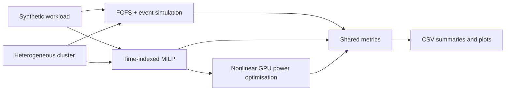
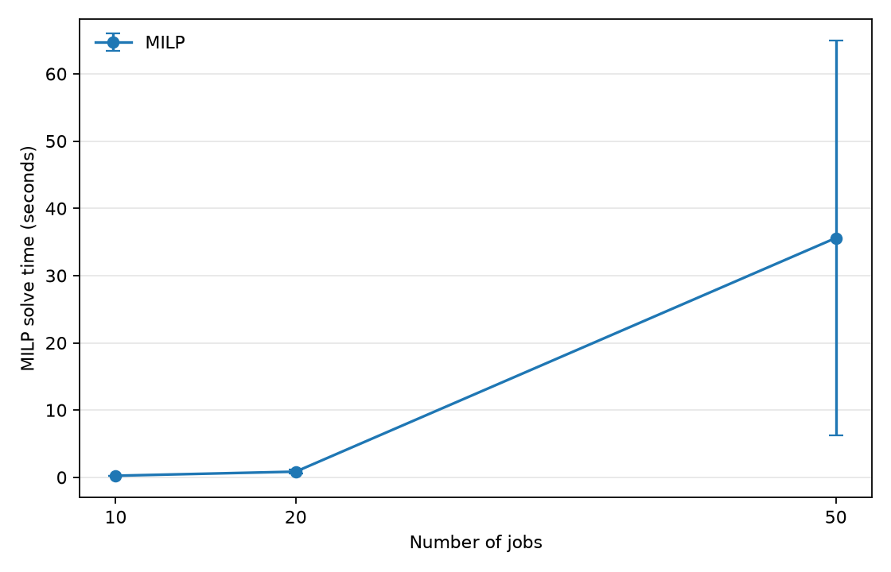
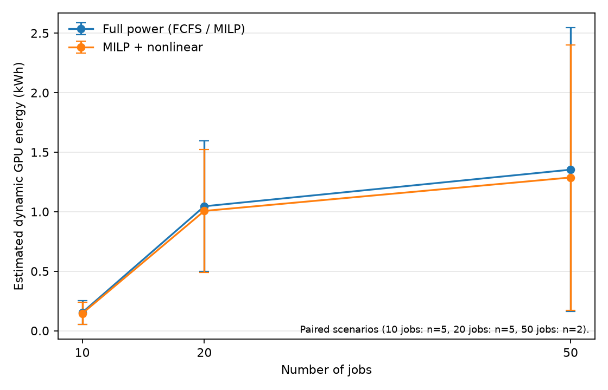
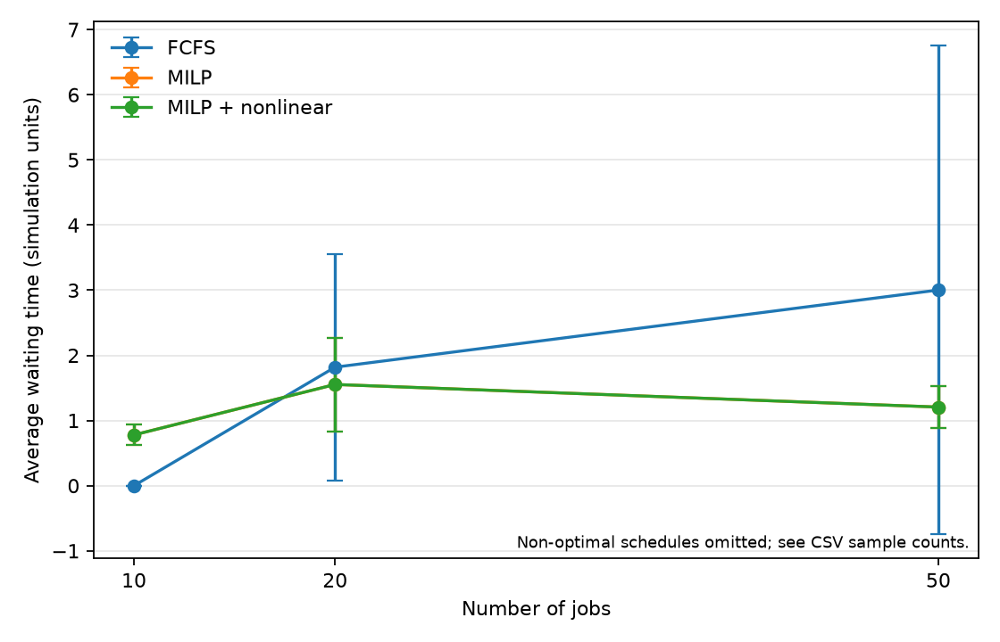
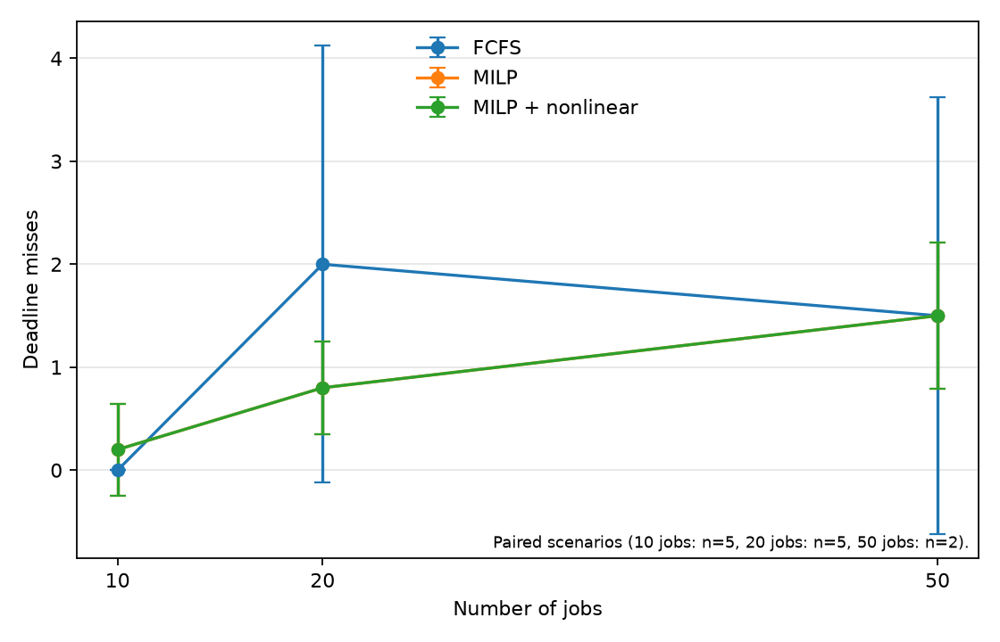

# HPC Workload Optimiser

A small HPC scheduling simulator exploring mixed-integer scheduling and nonlinear GPU power optimisation across heterogeneous CPU/GPU workloads.

This repository compares a strict scheduling baseline with time-indexed optimisation, then examines whether spare capacity within reserved scheduling slots can be used to reduce estimated GPU energy without invalidating the schedule.

Built in Python using PuLP/CBC for mixed-integer optimisation and SciPy SLSQP for constrained nonlinear optimisation.

## Motivation

My experience using SLURM during an HPC research internship made me interested in what happens underneath a user-facing batch scheduler: when jobs start, where they are placed, how limited resources create queues, and how scheduling decisions interact with energy use.

This project explores those questions through a small, stylised simulator. It is not intended to reproduce SLURM, Pawsey, Setonix, or any production HPC scheduler.

## Problem

Each synthetic batch job has a submission time, CPU and GPU requirements, memory demand, estimated runtime, deadline, and priority. Compute nodes have heterogeneous CPU, GPU, and memory capacities. Jobs execute non-pre-emptively on a single node.

The experiments compare:

- average waiting time
- makespan
- CPU/GPU utilisation
- deadline misses
- MILP model size and solve time
- estimated dynamic GPU energy

Priority is represented in the workload model, although the current FCFS and MILP objectives do not use it.

## Architecture



All three paths use the same schedule and allocation structures, allowing the metrics pipeline to evaluate them consistently.

## Methods

### FCFS baseline

The baseline follows strict first-come-first-served queue order with deterministic first-fit placement on a compatible node. Multiple jobs may share a node when CPU, GPU, and memory capacity permit.

If the job at the head of the queue cannot start, later jobs are not allowed to backfill around it. A discrete-event simulator advances virtual time between job submissions and completions.

### MILP scheduler

The PuLP/CBC scheduler uses configurable time slots.

Its binary decision variable is

$$
x_{jn\tau}=1
\quad
\text{when job }j\text{ starts on node }n\text{ in slot }\tau.
$$

Variables are created only for compatible nodes and valid start slots at or after the job's release time. Every job is scheduled exactly once:

$$
\sum_n \sum_{\tau \in T_{jn}} x_{jn\tau}=1.
$$

For each node $n$, scheduling slot $s$, and resource

$$
r \in \{\mathrm{CPU},\mathrm{GPU},\mathrm{memory}\},
$$

the total demand from active jobs cannot exceed the node capacity:

$$
\sum_j
\sum_{\tau:\,\tau \le s < \tau+d_j}
q_{jr}x_{jn\tau}
\le C_{nr}.
$$

Here,

$$
d_j=
\left\lceil
\frac{\mathrm{runtime}_j}{\Delta}
\right\rceil
$$

is the number of time slots reserved for job $j$, where $\Delta$ is the configurable slot size.

Selecting a start variable reserves those consecutive slots on one node, encoding both non-pre-emption and single-node execution. A serial feasible schedule is used to derive a finite optimisation horizon.

The weighted objective is

$$
\min\;
w_W\sum_j\mathrm{wait}_j
+
w_T\sum_j\mathrm{tardiness}_j
+
w_C C_{\max}.
$$

The named weights define the experimental trade-off between waiting time, deadline tardiness, and makespan rather than representing a universal scheduling cost model.

Because start times are discretised, an otherwise immediately runnable job may be delayed until the next slot boundary. This effect is most noticeable under light load.

### Nonlinear GPU power optimisation

After MILP scheduling, each GPU job receives a continuous power fraction

$$
p_j \in [p_{\min},1].
$$

The default stylised performance model is

$$
\mathrm{relative\ performance}(p_j)=p_j^{0.7},
$$

with adjusted runtime

```math
\mathrm{adjusted\ runtime}_j =
\frac{\mathrm{base\ runtime}_j}{p_j^{0.7}}
```

SciPy's SLSQP solver minimises estimated dynamic GPU energy.

With simulation time interpreted as minutes,

```math
E_j =
g_j P_{\mathrm{nominal}} p_j
\left(
\frac{\mathrm{adjusted\ runtime}_j}{60}
\right)
```

where $g_j$ is the number of GPUs requested and $P_{\mathrm{nominal}}$ is the assumed nominal power per GPU in kW.

Each adjusted runtime must remain within the scheduling slots already reserved by the MILP. If a job originally met its deadline, the nonlinear stage also constrains it to remain on time. Full power therefore remains a feasible starting point.

The $p^{0.7}$ relationship is deliberately simplified. It is a stylised nonlinear performance-power model, not an empirical model of any specific GPU.

## Results

The default benchmark evaluates:

- job counts: **10, 20, 50**
- seeds: **2026, 7, 42, 123, 999**
- MILP slot size: **2 simulation time units**
- CBC time limit: **60 seconds**

The synthetic cluster contains:

- one 64-CPU node
- one 64-CPU / 8-GPU node
- one 32-CPU / 4-GPU node

The 20-job workloads provide the strongest balanced comparison because all five MILP instances were proven optimal.

Values below are means across the same five seeds:

| Method | Average waiting time | Makespan | Deadline misses | GPU energy (kWh) |
|---|---:|---:|---:|---:|
| FCFS | 1.8187 | 64.4188 | 2.0 | 1.0456 |
| MILP | 1.5534 | 62.3854 | 0.8 | 1.0456 |
| MILP + nonlinear | 1.5534 | 63.0134 | 0.8 | 1.0066 |

Under moderate contention, the MILP reduced mean waiting time, makespan, and deadline misses relative to FCFS.

The nonlinear stage retained the same job start times and deadline-miss count while allowing some GPU jobs to run longer within their reserved windows. Its mean per-seed estimated GPU-energy reduction was **2.99%**.

FCFS and MILP have the same full-power GPU-energy estimate in this model because dynamic GPU energy depends on requested GPU count and execution time rather than job placement.

These results come from synthetic workloads and a stylised energy model. They should not be interpreted as evidence of equivalent savings on real hardware.

Raw observations, unpaired aggregates, and paired aggregates are available in:

- [benchmark_results.csv](results/benchmark_results.csv)
- [benchmark_summary.csv](results/benchmark_summary.csv)
- [benchmark_paired_summary.csv](results/benchmark_paired_summary.csv)

## Workload-dependent behaviour

### 10 jobs

The cluster is lightly loaded.

FCFS had zero mean waiting time and a mean makespan of `34.0648`. The MILP recorded `0.7790` mean waiting time and a `34.7780` makespan because release times are rounded to slot boundaries.

In this setting, FCFS performs better on those metrics because there is little contention for the optimiser to resolve while the MILP still incurs slot discretisation.

This is an important workload-dependent result rather than a failure of the experiment.

### 20 jobs

With moderate contention, the optimiser has more meaningful placement and timing choices.

All five CBC solves were proven optimal, making this the strongest comparison among the tested workload sizes.

### 50 jobs

The time-indexed formulation becomes substantially larger at 50 jobs.

Across the five model builds, it averaged:

- **23,343 binary variables**
- **2,062 constraints**
- **35.60 seconds mean solve time**

Three attempts reached the configured solver limit with a feasible incumbent but without a proof of optimality. Only seeds `2026` and `999` were proven optimal.

For this reason, a five-seed FCFS mean should not be compared directly with a two-seed MILP mean.

Within the paired two-seed subset:

| Method | Mean waiting time | Mean makespan | Mean deadline misses |
|---|---:|---:|---:|
| FCFS | 0.7919 | 136.4335 | 1.5 |
| MILP | 1.2063 | 137.1820 | 1.5 |

Two scenarios are not enough to support a broad conclusion, but they do show that the optimisation approach does not outperform FCFS under every tested workload.

## Scaling



Average MILP model size increased from approximately:

- **729 binary variables** at 10 jobs
- **3,459 binary variables** at 20 jobs
- **23,343 binary variables** at 50 jobs

The growth depends on both the number of jobs and the number of candidate start slots within the scheduling horizon.

The corresponding increase in solve time is a practical limitation of the time-indexed formulation used here.

## Energy trade-off



Across successful MILP schedules, nonlinear optimisation produced modest estimated energy reductions by extending GPU-job runtimes within their existing reserved windows.

An increase in GPU utilisation after power reduction can simply mean that jobs occupy the GPU for longer. It should not by itself be interpreted as improved computational efficiency.

The 50-job nonlinear result includes only the two scenarios for which the MILP was proven optimal, as indicated on the plot.

## Benchmark plots

### Average waiting time



### Deadline misses



Error bars show sample standard deviation across the available seeds.

The plots mark cases where non-optimal schedules were omitted. For like-for-like comparisons between methods, use the paired benchmark summary.

## Running the project

From the repository root:

```bash
python -m venv .venv
source .venv/bin/activate

python -m pip install -r requirements.txt

python -m pytest -q
python experiments/benchmark.py
```

The benchmark prints progress and overwrites its CSV and PNG outputs predictably.

Larger experiments may take several minutes because difficult MILPs can run until the configured solver time limit.

A smaller custom experiment can be launched without editing the source:

```bash
python experiments/benchmark.py \
  --job-counts 10 20 \
  --seeds 2026 7 \
  --milp-time-limit 30
```

## Repository structure

```text
src/hpc_optimiser/
├── models.py             # Jobs, nodes, allocations, and schedules
├── workload.py           # Seeded heterogeneous workload generation
├── fcfs.py               # Strict FCFS scheduling policy
├── simulator.py          # Discrete-event virtual-time replay
├── milp_scheduler.py     # Time-indexed PuLP/CBC scheduler
├── nonlinear_energy.py   # SLSQP GPU power optimisation
└── metrics.py            # Shared schedule metrics

experiments/
└── benchmark.py          # Reproducible CSV and plot pipeline

tests/                    # Fast unit and integration tests
results/                  # Raw results, summaries, and generated figures
```

## Assumptions and limitations

- Workloads are synthetic rather than public production traces.
- Jobs run non-pre-emptively on one node; multi-node jobs are excluded.
- Estimated runtime is treated as known and deterministic.
- MILP start times are discretised, while FCFS uses continuous event times.
- The GPU performance-power relationship is stylised rather than measured.
- Energy estimates include dynamic GPU execution only and exclude CPU, idle, cooling, and facility energy.
- Experiments are intentionally small.
- The time-indexed MILP scales poorly as job count and scheduling horizon grow.
- The optimisation objective and its weights are experimental rather than representations of production scheduler policy.
- This project studies optimisation behaviour; it is not a production scheduler or a model of a specific HPC system.

## Tests

The test suite contains **23 passing tests** covering:

- data-model validation
- deterministic workload generation
- FCFS scheduling behaviour
- MILP feasibility and resource constraints
- metric calculations
- nonlinear power bounds and schedule preservation
- energy arithmetic
- benchmark aggregation and paired comparisons

## Future work

- Evaluate the schedulers using public HPC workload traces.
- Compare alternative MILP formulations and heuristic or backfilling schedulers.
- Replace the stylised power curve with empirical GPU performance-power measurements.
- Explore simulation approaches that can support larger workloads.

## Licence

This project is available under the [MIT Licence](LICENSE).